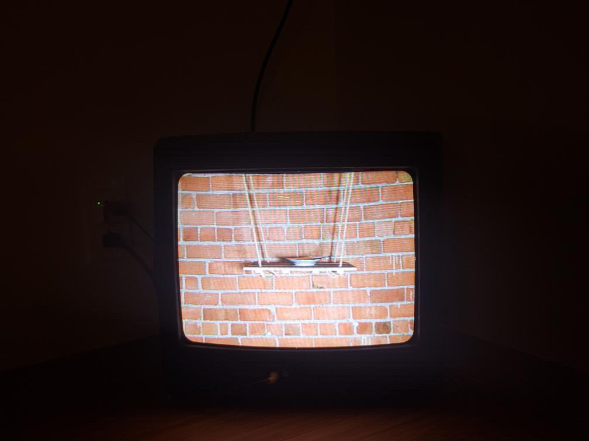
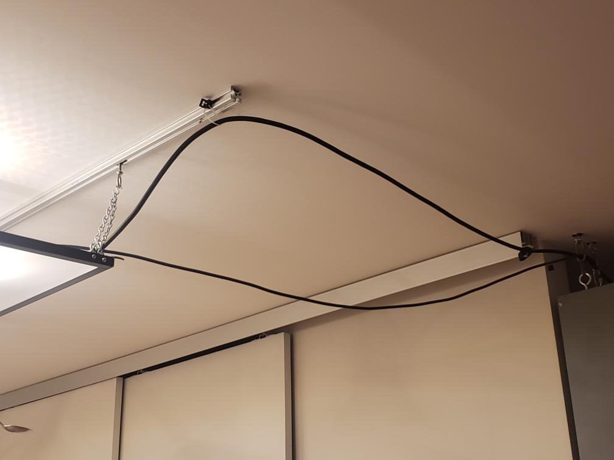
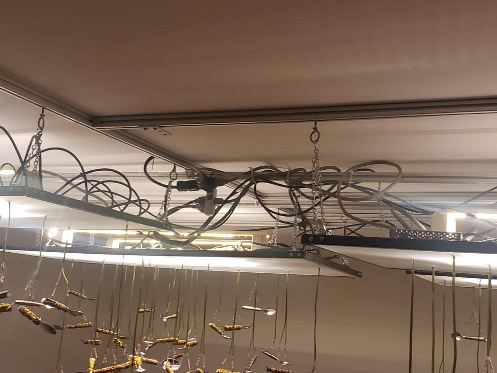

# Visite individuelle

## Introduction et informations
Le 4 mars 2024, je suis allé visiter la splendide exposition : Points de suspention. C'est une collaboration de Avatar et EISODE, qui sont toutes les deux des firmes d'exposition.

Voici quelques crédits supplémentaires :

Vidéo: John Blouin

Ingénieur électrique : Loup Letac

Enregistrements et texte : Jonathan Champagne

Aide technique : Roxana Bouchard

Source : https://www.eisode.art/pointsdesuspension

## Description de l'oeuvre ou du dispositif

Voici une description supplementaire par rapport a l'oeuvre, tirée directement du site web :

> «Points de suspension est une installation sonore et cinétique générative qui porte un regard sur les violences invisibles au sein des relations humaines. Des communautés d’objets en suspension sont animées par des principes d’attractions et de répulsions magnétiques et leurs interactions modifient des séquences sonores et vidéo. L’évolution des séquences transforme à son tour les paramètres de l’algorithme qui contrôle les événements électromagnétiques afin que l’œuvre se développe de manière autonome.»

source : https://www.eisode.art/pointsdesuspension

## Type d'installation
Contemplative, en raison de la nature explicite d'exposition de l'oeuvre. Cependant, il y a un aspect interactif au tout début, ou il faut aller chercher un code dans nos e-mails pour pouvoir rentrer dans l'appartement.

## Mise en espace
Quelques sales. Vérification.

## Composantes et techniques
Voici une liste des composantes techniques :

- toutes sortes de fils electriques pour les speaker, les cuillieres et les téles 
- des speaker
- des cuilleres
- un ordinateur
- des télés

## Éléments nécessaires à la mise en exposition
voici une liste des elements necessaires à la mise en exposition :

- un appartement
- un systeme de code pour la porte
- un systeme d'envoi d'e-mails
- cables
- speakers
- des télés
- des crochets
- systeme d'accrochage

## Expérience vécue
Ce qui serais attendu d'un visiteur : le sens de l'observation.

## Ce qui vous a plu
Le fait que ce soit une visite autonome m'a vraiment plu. Pour une fois, on nous laisse la chance, en tant que visiteur, de choisir exactement comment on experience l'oeuvre.

## Aspect que vous ne souhaiteriez pas retenir
La seule chose qui pourrait etre améliorer, c'est la grandeur de l'appartement.

