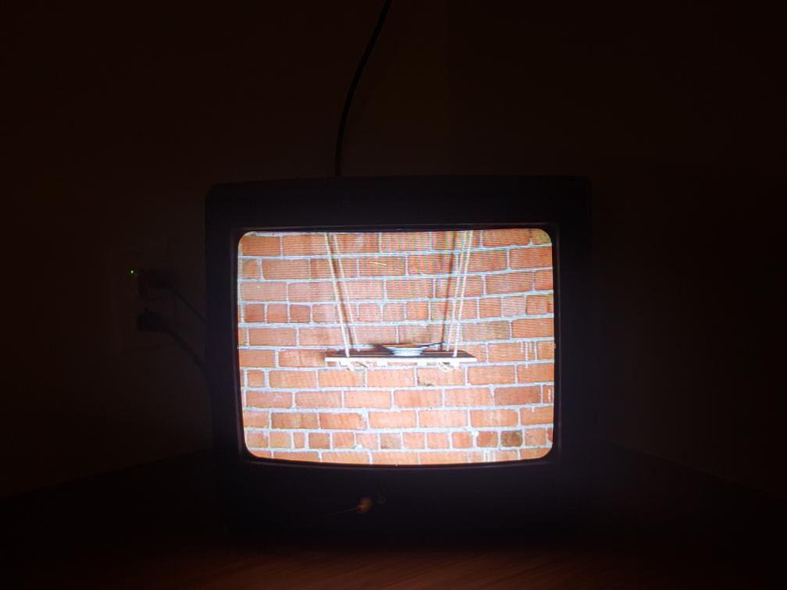
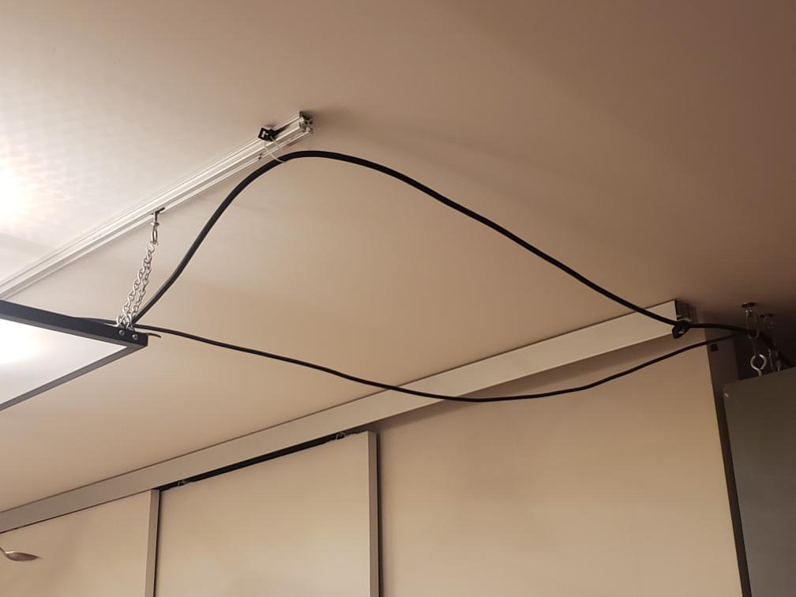
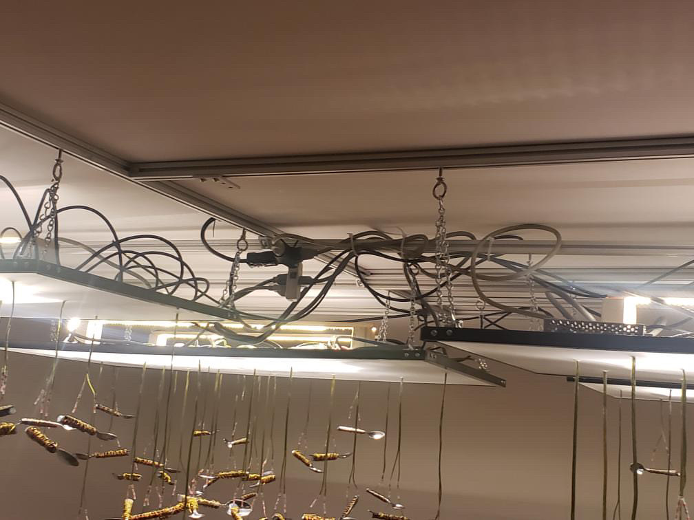
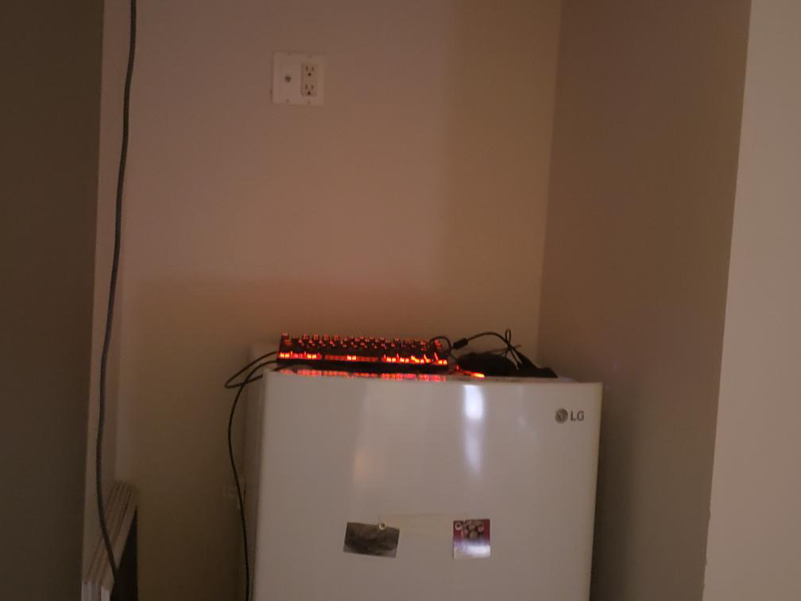

# Visite individuelle

## Introduction et informations

##

##

## Description de l'oeuvre ou du dispositif
Un appartement transforme en exposition. Dans la piece centrale, on a des cuilleres attachées au plafond. Ces cuillieres sont chargées electriquement par des cables et enssembles, elle forment un champ magnétique. ce champ magnétique fait en sorte que les cuilleres bougent et parfois, elloes s'entretouchent et s'attirent en raison du champ magnétique. Les autres salle sont remplies de fils, speakers et télés.

## Type d'installation
Contemplative, en raison de la nature explicite d'exposition de l'oeuvre. Cependant, il y a un aspect interactif au tout début, ou il faut aller chercher un code dans nos e-mails pour pouvoir rentrer dans l'appartement.

## Mise en espace
la mise en espace est simple : c'est un appartement avec quelques sales d'expositions. On se balade a travers le tout et on se rend compte que les expositions sont tres méticuleuses, mais que l'appartement n'est pas grand et qu'en faire le tour est une tache assé rapide.

## Composantes et techniques
Voici une liste des composantes techniques :

- toutes sortes de fils electriques pour les speaker, les cuillieres et les téles 
- des speaker
- des cuilleres
- un ordinateur
- des télés

## Éléments nécessaires à la mise en exposition
voici une liste des elements necessaires à la mise en exposition :

- un appartement
- un systeme de code pour la porte
- un systeme d'envoi d'e-mails
- cables
- speakers
- des télés
- des crochets
- systeme d'accrochage

## Expérience vécue
Ce qui serais attendu d'un visiteur : le sens de l'observation. Vu que l'exposition ne dure pas aussi longtemp et n'est pas aussi grande, il faut porter bien attentions au details pour bien apprecier l'oeuvre en toute sa splendeur. Si on prend le temp d'observer bien comme il faut chaque composants et leur mise en place, il est possible de trouver un aspect fascinant. Il est donc attendu d'un visiteur qu'il prenne son temp.

## Ce qui vous a plu
Le fait que ce soit une visite autonome m'a vraiment plu. Pour une fois, on nous laisse la chance, en tant que visiteur, de choisir exactement comment on experience l'oeuvre. Dans la grande majorité des cas, on nous guide ou on nous observe. Mais dans celle-ci, on dirais vraiment que on a le controle sur notre experience et que on est libre et calme. On rentre dans un appartement et on fait juste observer des oeuvres d'art que quelqun a laisser la pour nous. Je trouve l'idée vraiment géniale en raison d'a quel point c'est accesible pour tout le monde. Aussi, de toutes les oeuvres que on a eu la chance de voir dans ce cours, c'est les cuilleres magnétiques qui m'ont le plus captivés. Je veux dire, des cuilliere qui bougent presque magiquement? Sa, c'est vraiment, mais vraiment intéressant!

## Aspect que vous ne souhaiteriez pas retenir
La seule chose qui pourrait etre améliorer, c'est la grandeur de l'appartement. Je sais que le budget est limité et que il est possible que le monde volle des choses, cependant, je pense que un appartement plus grand avec plusieurs expositions de l'envergure des cuilleres serait encore plus incroyable. on voit et on admire les cuilleres une fois, et on a vus le meilleur. Meme si c'est tres intéressant, je pense que le fait d'en voir plusieurs dans ce context serait vraiment magique. Ce que je retiens, plutot de se que je ne retiens pas, c'est le fait d'essayer toujours de faire quelquechose dans sa version la plus "grandiose" quand on parle d'expositions. L'aspect "wow" est trs important et c'est cet aspect qui fait en sorte que les gens se rapellent du nom et de l'oeuvre.

